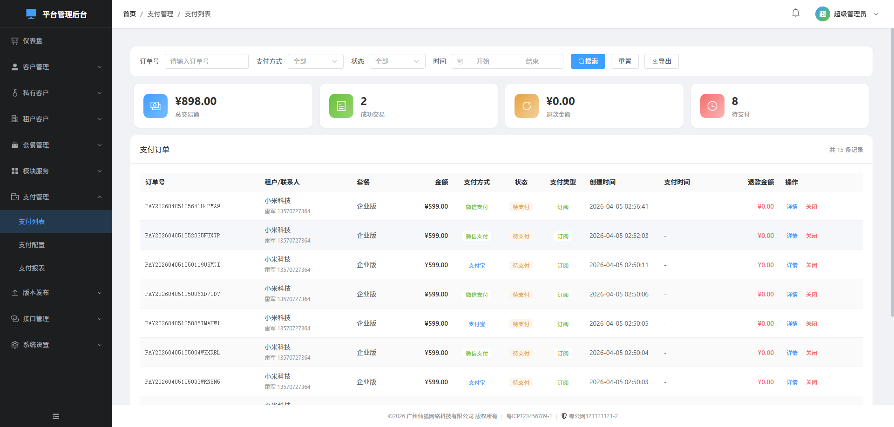

# Admin后台刷新保留页面与支付管理修复

**日期**: 2026-04-05  
**状态**: ✅ 已完成  
**涉及模块**: 管理后台(admin)、支付管理(payment)

---

## 一、任务概述

本次修复三个核心问题：
1. 管理后台每次刷新页面都回到仪表盘，应保留在当前页面
2. 支付管理的支付列表加载失败，获取订单无错误反馈
3. 支付管理的支付报表内容统计映射不正确

同时审查了支付模块的多租户数据隔离安全性。

---

## 二、问题清单与根因分析

### 问题1：管理后台刷新回到仪表盘

**根因**: 页面刷新后，Pinia store 丢失内存状态（`user`=null, `permissions`=[]）。虽然 token 从 `localStorage` 恢复使得 `isLoggedIn=true`，但路由守卫中 `hasPermission()` 检查时 `permissions` 为空数组。所有带 `permission` meta 的路由（除仪表盘外）都因权限检查失败而被重定向到 `/`（仪表盘）。而 `fetchProfile()` 在 `MainLayout.vue` 的 `onMounted` 中才调用，晚于路由守卫执行。

**影响范围**: 所有需要权限的页面（支付列表、客户管理、系统设置等）

### 问题2：支付列表加载失败

**根因**:
1. 前端 `fetchData()` 和 `fetchStats()` 的 catch 只有 `console.error`，用户无法感知错误
2. 后端订单查询使用 `LEFT JOIN subscriptions + GROUP BY po.id`，在 MySQL strict mode（ONLY_FULL_GROUP_BY）下可能报 SQL 错误
3. 一个订单可能关联多条订阅记录，导致 LEFT JOIN 产生重复行
4. 金额字段 `amount?.toFixed(2)` 在值为 undefined 时会报错
5. 缺少空数据和加载失败的友好状态展示

### 问题3：支付报表统计映射不正确

**根因**:
1. 后端 `/payment/reports` 接口：`customerType` 筛选参数被读取但未加入 SQL WHERE
2. 后端 `/payment/stats` 接口：只接收 `startDate/endDate`，忽略 `payType/customerType` 筛选，且缺少 `maxAmount` 字段
3. 后端时间序列数据未返回按支付方式拆分的金额（`wechatAmount/alipayAmount/bankAmount`）
4. 前端 `Reports.vue onMounted`：图表初始化在 `setQuickDate('month')` 触发的数据请求之后，存在竞态条件——若数据先于图表初始化返回，图表更新函数会因 chart 实例为 null 而跳过渲染
5. 前端表格 `wechatAmount/alipayAmount/bankAmount` 始终硬编码为 0
6. 平均客单价 `row.amount / row.count` 当 count=0 时产生 NaN
7. `formatMoney(NaN)` 显示 "NaN" 而非 "0.00"
8. 缺少 `onUnmounted` 清理（resize 监听器泄漏、echarts 实例未销毁）

### 数据隔离审查结果

- ✅ 管理后台支付接口为平台超级管理员使用，可见所有订单数据属于正常设计
- ✅ `payment_orders` 表有 `tenant_id`、`customer_type` 列保证租户级别数据隔离
- ✅ 公共支付 API（`/public/payment`）中正确按 `tenant_id` 过滤
- ✅ `customerType` 筛选通过 `tenant_name` 判断，不涉及跨租户数据泄露
- ✅ 不同租户即使有同名联系人或同手机号，数据通过 `tenant_id` 完全隔离

---

## 三、修复方案与实施

### 阶段1：修复页面刷新重定向问题

**修改文件**:
- `admin/src/stores/user.ts`
- `admin/src/router/index.ts`

**修改内容**:
1. Store 新增 `profileLoaded` 响应式标志
2. Store 新增 `profileLoadingPromise` 防并发锁
3. Store 新增 `ensureProfileLoaded()` 方法
4. `login()` 成功后设置 `profileLoaded = true`
5. `logout()` 清除 `profileLoaded` 和 `profileLoadingPromise`
6. `fetchProfile()` 在 `finally` 中设置 `profileLoaded = true`
7. 路由守卫改为 `async`，在权限检查前先 `await ensureProfileLoaded()`
8. 加载后若 token 失效（被 logout），重定向到登录页

**修复原理**: 页面刷新时，路由守卫在权限检查前先确保用户信息已从服务器加载完成（仅一次请求），再进行权限判断。

### 阶段2：修复支付列表加载失败

**修改文件**:
- `backend/src/routes/admin/payment.ts`（后端）
- `admin/src/views/payment/List.vue`（前端）

**后端修复**:
1. 订单查询 SQL：`LEFT JOIN + GROUP BY` → `EXISTS 子查询`，彻底消除 MySQL strict mode 兼容性问题和多行重复
2. Stats 接口增加 `payType` 和 `customerType` 筛选支持
3. Stats 接口新增 `maxAmount` 返回字段

**前端修复**:
1. 新增 `loadFailed` 状态标志，用于显示加载失败提示条
2. `fetchData()` 安全访问 `res.data?.list`，失败时重置数据
3. `fetchStats()` 使用 `Number()` 安全转换，失败时重置为 0
4. 金额显示 `amount?.toFixed(2)` → `Number(amount || 0).toFixed(2)`
5. 404 错误时手动弹出友好提示

### 阶段3：修复支付报表统计映射

**修改文件**:
- `backend/src/routes/admin/payment.ts`（后端）
- `admin/src/views/payment/Reports.vue`（前端）

**后端修复**:
1. Reports 接口增加 `customerType` SQL 筛选条件
2. Reports 接口增加表是否存在检查
3. 时间序列查询增加按支付方式拆分金额（`wechatAmount/alipayAmount/bankAmount`）

**前端修复**:
1. `onMounted` 执行顺序修正：先 `await nextTick()` → 初始化图表 → 再 `setQuickDate('month')` 请求数据
2. 表格数据映射正确读取后端返回的 `wechatAmount/alipayAmount/bankAmount`
3. 平均客单价除零保护：`row.count > 0 ? row.amount / row.count : 0`
4. `formatMoney` 增加 NaN 保护
5. `fetchSummary` 使用 `Number()` 安全转换和 `??` 空值合并
6. 新增 `onUnmounted` 清理 resize 监听器和 echarts 实例
7. `fetchReports` 失败时清空表格数据

---

## 四、修改文件清单

| 文件路径 | 修改类型 | 说明 |
|---------|---------|------|
| `admin/src/stores/user.ts` | 修改 | 新增 profileLoaded 标志和 ensureProfileLoaded 方法 |
| `admin/src/router/index.ts` | 修改 | 路由守卫改为 async，刷新时等待用户信息加载 |
| `admin/src/views/payment/List.vue` | 修改 | 错误处理增强、空值安全、加载失败提示 |
| `admin/src/views/payment/Reports.vue` | 修改 | 图表竞态修复、数据映射修复、除零保护、内存泄漏修复 |
| `backend/src/routes/admin/payment.ts` | 修改 | SQL 兼容性修复、stats/reports 筛选增强、数据字段补全 |

---

## 五、测试要点

1. **刷新保留页面**: 在任意页面（如支付列表、系统设置）刷新浏览器，应停留在当前页面而非回到仪表盘
2. **Token 过期**: 刷新时如 token 已过期，应正确跳转到登录页
3. **支付列表**: 正常加载订单列表、统计卡片数据正确显示
4. **支付列表失败处理**: 后端不可用时显示红色错误提示条和重新加载按钮
5. **支付报表图表**: 收入趋势图、支付方式饼图、套餐排行柱状图、客户类型饼图均正确渲染
6. **支付报表筛选**: 支付方式和客户类型筛选生效（图表和表格都更新）
7. **报表表格**: 微信支付/支付宝/对公转账金额正确拆分显示，平均客单价不出现 NaN
8. **数据隔离**: 不同租户的支付数据通过 tenant_id 隔离，管理员可查看全部

---

## 六、注意事项

- 路由守卫的 `ensureProfileLoaded()` 使用防并发锁，避免多个路由同时触发重复请求
- 后端 stats 接口兼容了 List.vue（不带 payType/customerType 参数）和 Reports.vue（带参数）两种调用场景
- echarts 实例在组件卸载时正确 dispose，避免内存泄漏
- 所有金额处理均使用 `Number()` 安全转换，防止字符串类型导致计算错误

---

## 七、补充修复：支付类型字段映射不一致（2026-04-05 追加）

### 问题描述

支付列表中所有订单的"支付类型"列全部显示"订阅"，但点击详情弹窗却显示"一次性付费"，两者不一致。实际上大部分订单是一次性付费。

### 根因分析

1. **列表查询（错误逻辑）**：使用 `EXISTS (SELECT 1 FROM subscriptions WHERE tenant_id = po.tenant_id AND status IN (...))` 判断支付类型。这判断的是"该租户是否有任何活跃订阅"，而非"这笔订单本身的计费类型"。只要租户有一个活跃订阅，该租户所有历史订单都被标记为"订阅"。
2. **详情查询（缺失字段）**：`SELECT * FROM payment_orders` 返回原始字段，其中没有 `payment_type` 字段。前端判断 `payment_type === 'subscription'` 为 undefined/false，所以总是显示"一次性付费"。
3. **正确数据源**：`payment_orders` 表有 `billing_cycle` 字段（`monthly`/`yearly`/`once`），每笔订单创建时由前端传入，这才是正确的判断依据。

### 修复方案

- **列表查询**：删除 subscriptions EXISTS 判断，改用 `CASE WHEN po.billing_cycle IN ('monthly', 'yearly') THEN 'subscription' ELSE 'normal' END`
- **详情查询**：同样派生 `payment_type`：`CASE WHEN billing_cycle IN ('monthly', 'yearly') THEN 'subscription' ELSE 'normal' END as payment_type`
- 两处均添加 `billing_cycle` 列存在性检查，兼容未迁移的旧数据库

### 映射规则

| billing_cycle | payment_type | 前端显示 |
|--------------|-------------|---------|
| `monthly` | subscription | 订阅 |
| `yearly` | subscription | 订阅 |
| `once` | normal | 一次性 |
| NULL/其他 | normal | 一次性 |

### 修改文件

| 文件 | 修改内容 |
|-----|---------|
| `backend/src/routes/admin/payment.ts` | 列表查询和详情查询统一使用 billing_cycle 判断 payment_type |

