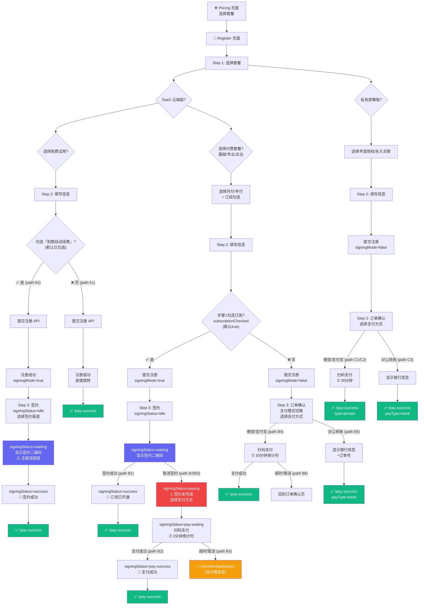

# 官网套餐注册全路径流程分析与流程图

> 任务日期：2026-04-05  
> 任务类型：审查分析  
> 对应代码：`website/src/views/Pricing.vue`、`Register.vue`、`PaySuccess.vue`  
> 核心状态变量：`step`、`signingMode`、`signingStatus`、`paymentOrder`、`subscriptionChecked`、`payMode`

---

## 一、核心状态变量说明

| 变量 | 类型 | 说明 |
|------|------|------|
| `step` | `1 \| 2 \| 3` | 当前注册步骤 |
| `selectedPlan` | `string` | 选中的套餐 key |
| `planType` | `'saas' \| 'private'` | 套餐版本类型 |
| `billingCycle` | `'monthly' \| 'yearly'` | SaaS 计费周期 |
| `privateBillingMode` | `'perpetual' \| 'annual'` | 私有部署计费模式 |
| `subscriptionChecked` | `boolean` (默认`true`) | 步骤1是否勾选订阅自动续费 |
| `form.autoRenew` | `boolean` (默认`true`) | 免费试用-步骤2是否勾选到期自动续费 |
| `form.autoRenewPackage` | `string` (默认`'SAAS_BASIC'`) | 免费试用-自动续费目标套餐 |
| `signingMode` | `boolean` | 是否进入签约模式 |
| `signingStatus` | `'idle' \| 'waiting' \| 'success' \| 'paying' \| 'pay-waiting' \| 'pay-success'` | 签约状态机 |
| `isTrialSigning` | `computed boolean` | 是否为免费试用的签约 |
| `payMode` | `'subscription' \| 'normal'` | 步骤3支付模式 |
| `paymentOrder` | `object \| null` | 支付订单信息 |
| `paymentMethod` | `'wechat' \| 'alipay' \| 'bank'` | 支付方式 |

---

## 二、完整路径清单（JSON 格式）

```json
{
  "flowPaths": [
    {
      "pathId": "A1",
      "name": "免费试用 - 不勾选自动续费",
      "category": "免费套餐",
      "signingInvolved": false,
      "totalSteps": 3,
      "conditions": {
        "selectedPlan": "FREE_TRIAL",
        "form.autoRenew": false
      },
      "flow": [
        {
          "step": 1,
          "action": "选择套餐",
          "detail": "选择 SaaS 云端版 → 7天免费试用",
          "uiState": "planType='saas', selectedPlan='FREE_TRIAL'"
        },
        {
          "step": 2,
          "action": "填写信息",
          "detail": "填写企业名称、联系人、手机号、验证码；取消勾选「试用到期后自动续费」；同意协议",
          "uiState": "form.autoRenew=false"
        },
        {
          "step": "submit",
          "action": "提交注册",
          "detail": "调用 POST /api/v1/public/register",
          "apiPayload": {
            "packageCode": "FREE_TRIAL",
            "autoRenew": false
          }
        },
        {
          "step": "redirect",
          "action": "直接跳转成功页",
          "detail": "router.push('/pay-success') 携带 tenantCode、licenseKey、adminUsername、adminPassword",
          "destination": "/pay-success?plan=FREE_TRIAL&type=saas"
        }
      ],
      "codeReference": "Register.vue L1228-L1247 (handleSubmitInfo)"
    },
    {
      "pathId": "A2",
      "name": "免费试用 - 勾选自动续费 → 签约成功",
      "category": "免费套餐",
      "signingInvolved": true,
      "totalSteps": 5,
      "conditions": {
        "selectedPlan": "FREE_TRIAL",
        "form.autoRenew": true,
        "form.autoRenewPackage": "SAAS_BASIC (或 SAAS_PRO / SAAS_ENTERPRISE)"
      },
      "flow": [
        {
          "step": 1,
          "action": "选择套餐",
          "detail": "选择 SaaS 云端版 → 7天免费试用"
        },
        {
          "step": 2,
          "action": "填写信息 + 勾选自动续费",
          "detail": "填写基本信息；保持勾选「试用到期后自动续费」(默认已勾选)；选择续费目标套餐(默认基础版)",
          "uiState": "form.autoRenew=true, form.autoRenewPackage='SAAS_BASIC'"
        },
        {
          "step": "submit",
          "action": "提交注册",
          "detail": "调用注册API → 成功 → signingMode=true, signingStatus='idle', step=3",
          "apiPayload": {
            "packageCode": "FREE_TRIAL",
            "autoRenew": true,
            "autoRenewPackage": "SAAS_BASIC"
          }
        },
        {
          "step": "3-idle",
          "action": "签约-选择渠道",
          "detail": "显示注册成功提示(租户编码、授权码)；选择签约渠道(微信委托代扣/支付宝周期扣款)；点击「开始签约」",
          "signingStatus": "idle",
          "notice": "签约后不会立即扣费，仅在7天试用期结束后自动扣款"
        },
        {
          "step": "3-waiting",
          "action": "签约-等待扫码",
          "detail": "调用 POST /api/v1/public/register/subscribe → 显示签约二维码；轮询签约状态(每3秒)",
          "signingStatus": "waiting",
          "importantRule": "【免费试用签约没有「取消签约」按钮，用户必须完成签约】",
          "buttons": ["我已完成签约"]
        },
        {
          "step": "3-success",
          "action": "签约成功",
          "detail": "显示签约成功信息：自动续费已设置，7天后自动续费为目标套餐",
          "signingStatus": "success",
          "buttons": ["🚀 开始使用"]
        },
        {
          "step": "redirect",
          "action": "跳转成功页",
          "destination": "/pay-success?plan=FREE_TRIAL&type=saas"
        }
      ],
      "codeReference": "Register.vue L1229-L1234 (免费签约入口), L1454-L1505 (签约逻辑)"
    },
    {
      "pathId": "B1",
      "name": "SaaS付费套餐 - 勾选订阅 → 签约成功",
      "category": "付费套餐-签约",
      "signingInvolved": true,
      "totalSteps": 5,
      "conditions": {
        "selectedPlan": "basic | pro | enterprise",
        "planType": "saas",
        "subscriptionChecked": true,
        "currentPkgSubscriptionEnabled": true
      },
      "flow": [
        {
          "step": 1,
          "action": "选择套餐 + 计费周期 + 订阅",
          "detail": "选择SaaS付费套餐(基础版/专业版/企业版)；选择月付或年付；保持勾选「到期自动续费」(默认已勾选)",
          "uiState": "subscriptionChecked=true → payMode='subscription'"
        },
        {
          "step": 2,
          "action": "填写信息",
          "detail": "填写企业名称、联系人、手机号、验证码等；同意协议"
        },
        {
          "step": "submit",
          "action": "提交注册",
          "detail": "注册API → 成功 → signingMode=true, signingStatus='idle', step=3",
          "branchCondition": "subscriptionChecked && currentPkgSubscriptionEnabled && planType==='saas'"
        },
        {
          "step": "3-idle",
          "action": "签约-选择渠道",
          "detail": "显示注册成功提示；选择签约渠道；点击「开始签约」",
          "signingStatus": "idle",
          "notice": "签约后首期立即扣款，之后每月/年自动续费"
        },
        {
          "step": "3-waiting",
          "action": "签约-等待扫码",
          "detail": "显示签约二维码；轮询签约状态",
          "signingStatus": "waiting",
          "importantRule": "【付费套餐签约有「取消签约」按钮，可以退出签约走正常付费】",
          "buttons": ["取消签约", "我已完成签约"]
        },
        {
          "step": "3-success",
          "action": "签约成功",
          "detail": "订阅已开通，首期自动扣款。显示「开始使用」按钮",
          "signingStatus": "success"
        },
        {
          "step": "redirect",
          "action": "跳转成功页",
          "destination": "/pay-success?plan={selectedPlan}&type=saas"
        }
      ],
      "codeReference": "Register.vue L1249-L1254 (付费签约入口)"
    },
    {
      "pathId": "B2",
      "name": "SaaS付费套餐 - 勾选订阅 → 取消签约 → 正常付费成功",
      "category": "付费套餐-签约取消后付费",
      "signingInvolved": true,
      "totalSteps": 7,
      "conditions": {
        "selectedPlan": "basic | pro | enterprise",
        "subscriptionChecked": true,
        "userAction": "取消签约后选择正常付费"
      },
      "flow": [
        {
          "step": 1,
          "action": "选择套餐 + 勾选订阅"
        },
        {
          "step": 2,
          "action": "填写信息"
        },
        {
          "step": "submit",
          "action": "提交注册 → signingMode=true"
        },
        {
          "step": "3-idle",
          "action": "签约-选择渠道 → 开始签约",
          "signingStatus": "idle"
        },
        {
          "step": "3-waiting",
          "action": "签约-等待中 → 用户点击「取消签约」",
          "signingStatus": "waiting → paying",
          "detail": "cancelSigning() → signingStatus='paying', paymentMethod='wechat'"
        },
        {
          "step": "3-paying",
          "action": "签约未完成-选择正常支付方式",
          "detail": "显示⚠签约未完成提示；显示订单摘要(套餐名+计费周期+应付金额)；选择支付方式(仅微信/支付宝，无对公转账)",
          "signingStatus": "paying",
          "availablePayMethods": ["wechat", "alipay"],
          "buttons": ["确认支付"]
        },
        {
          "step": "3-pay-waiting",
          "action": "等待支付",
          "detail": "调用 POST /api/v1/public/payment/create → 显示二维码；倒计时3分钟；轮询支付状态",
          "signingStatus": "pay-waiting",
          "expireCountdown": "3分钟",
          "buttons": ["取消支付", "我已完成支付"]
        },
        {
          "step": "3-pay-success",
          "action": "支付成功",
          "detail": "显示支付成功 + 授权信息(租户编码、授权码、管理员账号)",
          "signingStatus": "pay-success",
          "buttons": ["🚀 开始使用", "👤 进入会员中心"]
        },
        {
          "step": "redirect",
          "action": "跳转成功页",
          "destination": "/pay-success?plan={selectedPlan}&type=saas"
        }
      ],
      "codeReference": "Register.vue L1524-L1529 (cancelSigning), L1539-L1593 (handleSkipSigningPayment)"
    },
    {
      "pathId": "B3",
      "name": "SaaS付费套餐 - 勾选订阅 → 取消签约 → 付费超时/取消",
      "category": "付费套餐-签约取消后放弃",
      "signingInvolved": true,
      "totalSteps": 7,
      "conditions": {
        "selectedPlan": "basic | pro | enterprise",
        "subscriptionChecked": true,
        "userAction": "取消签约后放弃付费"
      },
      "flow": [
        {
          "step": "1-2-submit",
          "action": "同 B2 前面步骤"
        },
        {
          "step": "3-waiting → 3-paying → 3-pay-waiting",
          "action": "取消签约 → 创建订单 → 等待支付"
        },
        {
          "step": "timeout-or-cancel",
          "action": "用户取消或3分钟超时",
          "detail": "handleCancelSkipPayment() → router.push('/member/dashboard')",
          "destination": "/member/dashboard (未付费状态)"
        }
      ],
      "timeoutBehavior": {
        "duration": "3分钟",
        "action": "自动跳转会员中心，paymentOrder置空",
        "codeReference": "Register.vue L1352-L1370 (startExpireCountdown)"
      }
    },
    {
      "pathId": "B4",
      "name": "SaaS付费套餐 - 不勾选订阅 → 正常支付(微信/支付宝)",
      "category": "付费套餐-正常支付",
      "signingInvolved": false,
      "totalSteps": 5,
      "conditions": {
        "selectedPlan": "basic | pro | enterprise",
        "subscriptionChecked": false,
        "payMode": "normal",
        "paymentMethod": "wechat | alipay"
      },
      "flow": [
        {
          "step": 1,
          "action": "选择套餐 + 取消勾选订阅",
          "detail": "选择SaaS付费套餐；选择月付/年付；取消勾选「到期自动续费」",
          "uiState": "subscriptionChecked=false → payMode='normal'"
        },
        {
          "step": 2,
          "action": "填写信息"
        },
        {
          "step": "submit",
          "action": "提交注册 → signingMode=false, step=3",
          "detail": "因subscriptionChecked=false，不进入签约模式"
        },
        {
          "step": "3-order-confirm",
          "action": "订单确认",
          "detail": "显示订单摘要(套餐、计费周期、应付金额)；可切换支付模式(订阅付费/正常支付)；选择支付方式(微信/支付宝/对公转账)",
          "uiComponents": [
            "pay-mode-toggle (如套餐支持订阅仍可切换回订阅模式)",
            "payment-options (微信/支付宝/对公转账)"
          ],
          "buttons": ["上一步", "确认支付"]
        },
        {
          "step": "3-qrcode",
          "action": "扫码支付",
          "detail": "调用 POST /api/v1/public/payment/create → 显示二维码；倒计时30分钟；轮询支付状态(每3秒)",
          "expireCountdown": "30分钟",
          "buttons": ["取消支付", "我已完成支付"]
        },
        {
          "step": "redirect",
          "action": "支付成功 → 跳转成功页",
          "destination": "/pay-success?plan={selectedPlan}&type=saas"
        }
      ],
      "codeReference": "Register.vue L1267-L1309 (handleCreatePayment)"
    },
    {
      "pathId": "B5",
      "name": "SaaS付费套餐 - 不勾选订阅 → 对公转账",
      "category": "付费套餐-对公转账",
      "signingInvolved": false,
      "totalSteps": 5,
      "conditions": {
        "selectedPlan": "basic | pro | enterprise",
        "subscriptionChecked": false,
        "paymentMethod": "bank"
      },
      "flow": [
        {
          "step": 1,
          "action": "选择套餐"
        },
        {
          "step": 2,
          "action": "填写信息"
        },
        {
          "step": "submit",
          "action": "提交注册 → signingMode=false"
        },
        {
          "step": "3-order-confirm",
          "action": "订单确认 → 选择对公转账",
          "detail": "选择支付方式为「对公转账」"
        },
        {
          "step": "3-bank-info",
          "action": "对公转账信息",
          "detail": "显示银行信息(开户银行、账户名称、银行账号、开户支行)；显示订单号(需填入转账备注)",
          "buttons": ["取消订单", "我已完成转账"]
        },
        {
          "step": "redirect",
          "action": "跳转成功页(等待确认)",
          "destination": "/pay-success?plan={selectedPlan}&type=saas&payType=bank&orderNo={orderNo}"
        }
      ],
      "codeReference": "Register.vue L1404-L1419 (handleBankTransferDone)"
    },
    {
      "pathId": "B6",
      "name": "SaaS付费套餐 - 不勾选订阅 → 支付超时/取消",
      "category": "付费套餐-支付失败",
      "signingInvolved": false,
      "totalSteps": 5,
      "conditions": {
        "paymentMethod": "wechat | alipay",
        "userAction": "30分钟超时或取消支付"
      },
      "flow": [
        {
          "step": "1-2-submit-confirm",
          "action": "同 B4 前面步骤"
        },
        {
          "step": "3-qrcode",
          "action": "显示二维码 → 30分钟超时",
          "detail": "超时: alert('订单已过期') → paymentOrder=null → 回到订单确认页; 取消: handleCancelPayment() → paymentOrder=null → 回到订单确认页"
        }
      ],
      "codeReference": "Register.vue L1350-L1370 (startExpireCountdown), L1422-L1427 (handleCancelPayment)"
    },
    {
      "pathId": "B7",
      "name": "SaaS付费套餐 - 步骤1取消订阅但步骤3重新切换为订阅模式",
      "category": "付费套餐-步骤3切换订阅",
      "signingInvolved": false,
      "totalSteps": 5,
      "conditions": {
        "selectedPlan": "basic | pro | enterprise",
        "subscriptionChecked": false,
        "step3_payMode_switch": "subscription"
      },
      "flow": [
        {
          "step": 1,
          "action": "选择套餐 + 取消勾选订阅",
          "uiState": "subscriptionChecked=false"
        },
        {
          "step": 2,
          "action": "填写信息"
        },
        {
          "step": "submit",
          "action": "提交注册 → signingMode=false (因步骤1未勾选订阅)",
          "detail": "进入普通支付模式"
        },
        {
          "step": "3-order-confirm",
          "action": "订单确认 → 切换支付模式为订阅",
          "detail": "在步骤3的「支付模式」区域，将payMode从'normal'切回'subscription'；此时按钮文案变为「确认签约并支付」；但实际调用的仍是 handleCreatePayment()",
          "uiState": "payMode='subscription'",
          "note": "⚠ 潜在问题：步骤3切换到订阅模式，但signingMode=false，实际走的是创建普通支付订单(handleCreatePayment)，而非签约流程"
        },
        {
          "step": "3-qrcode",
          "action": "创建支付订单 → 显示二维码 → 支付",
          "detail": "同 B4 路径的二维码支付流程，30分钟倒计时"
        },
        {
          "step": "redirect",
          "action": "支付成功 → 跳转成功页",
          "destination": "/pay-success"
        }
      ],
      "issue": "步骤3的payMode切换仅影响显示金额(订阅折扣价)和按钮文案，但没有实际触发签约流程。handleCreatePayment 中未根据 payMode 区分签约/非签约逻辑",
      "codeReference": "Register.vue L646-L669 (pay-mode-toggle), L1267-L1309 (handleCreatePayment)"
    },
    {
      "pathId": "C1",
      "name": "私有部署 - 永久买断 → 微信/支付宝支付",
      "category": "私有部署",
      "signingInvolved": false,
      "totalSteps": 5,
      "conditions": {
        "planType": "private",
        "selectedPlan": "private-standard | private-pro | private-enterprise",
        "privateBillingMode": "perpetual",
        "paymentMethod": "wechat | alipay"
      },
      "flow": [
        {
          "step": 1,
          "action": "选择私有部署套餐 + 永久买断",
          "detail": "选择私有部署版标准版/专业版/企业版；选择永久买断模式"
        },
        {
          "step": 2,
          "action": "填写信息"
        },
        {
          "step": "submit",
          "action": "提交注册 → signingMode=false, step=3",
          "detail": "私有部署不支持订阅签约"
        },
        {
          "step": "3-order-confirm",
          "action": "订单确认(永久买断)",
          "detail": "授权方式: 永久买断；选择微信/支付宝"
        },
        {
          "step": "3-qrcode",
          "action": "扫码支付(30分钟)",
          "detail": "同 SaaS 正常支付流程"
        },
        {
          "step": "redirect",
          "action": "支付成功 → 跳转成功页(私有部署)",
          "destination": "/pay-success?plan={selectedPlan}&type=private"
        }
      ]
    },
    {
      "pathId": "C2",
      "name": "私有部署 - 年度授权 → 微信/支付宝支付",
      "category": "私有部署",
      "signingInvolved": false,
      "totalSteps": 5,
      "conditions": {
        "planType": "private",
        "privateBillingMode": "annual",
        "paymentMethod": "wechat | alipay"
      },
      "flow": [
        {
          "step": 1,
          "action": "选择私有部署套餐 + 年度授权"
        },
        {
          "step": 2,
          "action": "填写信息"
        },
        {
          "step": "submit",
          "action": "提交注册"
        },
        {
          "step": "3-order-confirm",
          "action": "订单确认(年度授权)",
          "detail": "授权方式: 年度授权(1年)；显示折扣信息"
        },
        {
          "step": "3-qrcode → redirect",
          "action": "支付 → 成功页"
        }
      ]
    },
    {
      "pathId": "C3",
      "name": "私有部署 - 对公转账",
      "category": "私有部署",
      "signingInvolved": false,
      "totalSteps": 5,
      "conditions": {
        "planType": "private",
        "paymentMethod": "bank"
      },
      "flow": [
        {
          "step": "1-2-submit",
          "action": "选择私有部署套餐 → 填写信息 → 提交注册"
        },
        {
          "step": "3-order-confirm",
          "action": "订单确认 → 选择对公转账"
        },
        {
          "step": "3-bank-info → redirect",
          "action": "显示银行信息 → 我已完成转账 → 成功页(等待确认)",
          "destination": "/pay-success?payType=bank"
        }
      ]
    }
  ]
}
```

---

## 三、Mermaid 流程图 - 全路径总览



---

## 四、签约状态机详细图

```mermaid
stateDiagram-v2
    [*] --> idle: signingMode=true

    idle --> waiting: handleStartSigning()<br>POST /register/subscribe

    waiting --> success: 轮询签约状态=active
    waiting --> paying: cancelSigning()<br>【仅付费套餐可用】

    paying --> pay_waiting: handleSkipSigningPayment()<br>POST /payment/create

    pay_waiting --> pay_success: 轮询支付状态=paid
    pay_waiting --> member_dashboard: handleCancelSkipPayment()<br>或 3分钟超时

    success --> pay_success_page: goToSuccess()
    pay_success --> pay_success_page: goToSuccess()
    member_dashboard --> [*]: /member/dashboard

    note right of idle: 选择签约渠道<br>微信/支付宝
    note right of waiting: 免费试用: 无取消按钮<br>付费套餐: 有取消按钮
    note right of paying: ⚠签约未完成<br>选支付方式(仅微信/支付宝)
    note right of pay_waiting: ⏱ 3分钟倒计时<br>显示支付二维码
```

---

## 五、路径对比总表

| 路径ID | 套餐类型 | 签约? | 订阅勾选 | 支付方式 | 步骤数 | 最终去向 | 倒计时 |
|--------|---------|-------|---------|---------|--------|---------|--------|
| **A1** | 免费试用 | ❌ | autoRenew=false | 无需支付 | 3 | /pay-success | 无 |
| **A2** | 免费试用 | ✅ 必须完成 | autoRenew=true | 签约(不扣费) | 5 | /pay-success | 无 |
| **B1** | SaaS付费 | ✅ 成功 | subscriptionChecked=true | 签约代扣 | 5 | /pay-success | 无 |
| **B2** | SaaS付费 | ✅→取消→付费成功 | subscriptionChecked=true | 微信/支付宝 | 7 | /pay-success | 3分钟 |
| **B3** | SaaS付费 | ✅→取消→放弃 | subscriptionChecked=true | - | 7 | /member/dashboard | 3分钟 |
| **B4** | SaaS付费 | ❌ | subscriptionChecked=false | 微信/支付宝 | 5 | /pay-success | 30分钟 |
| **B5** | SaaS付费 | ❌ | subscriptionChecked=false | 对公转账 | 5 | /pay-success(bank) | 无 |
| **B6** | SaaS付费 | ❌ | subscriptionChecked=false | 微信/支付宝超时 | 5 | 回到订单确认 | 30分钟 |
| **B7** | SaaS付费 | ❌⚠ | Step1=false→Step3切回 | 创建普通订单 | 5 | /pay-success | 30分钟 |
| **C1** | 私有永久买断 | ❌ | 不支持 | 微信/支付宝 | 5 | /pay-success(private) | 30分钟 |
| **C2** | 私有年度授权 | ❌ | 不支持 | 微信/支付宝 | 5 | /pay-success(private) | 30分钟 |
| **C3** | 私有部署 | ❌ | 不支持 | 对公转账 | 5 | /pay-success(bank) | 无 |

---

## 六、关键差异对比

### 免费 vs 付费签约的核心差异

```json
{
  "comparison": {
    "freeTrialSigning": {
      "triggerCondition": "selectedPlan='FREE_TRIAL' && form.autoRenew=true",
      "signingEntrance": "handleSubmitInfo() L1229-L1234",
      "cancelButton": false,
      "description": "免费试用签约 waiting 状态没有「取消签约」按钮，用户必须完成签约才能继续",
      "firstCharge": "签约后不立即扣费，7天试用期结束后自动扣款",
      "targetPackage": "form.autoRenewPackage (用户选择的续费目标套餐)",
      "billingCycle": "固定 monthly"
    },
    "paidPlanSigning": {
      "triggerCondition": "subscriptionChecked=true && currentPkgSubscriptionEnabled && planType='saas'",
      "signingEntrance": "handleSubmitInfo() L1249-L1254",
      "cancelButton": true,
      "description": "付费套餐签约 waiting 状态有「取消签约」按钮，可退出走正常付费",
      "firstCharge": "签约后首期立即扣款",
      "targetPackage": "当前选择的付费套餐",
      "billingCycle": "跟随 billingCycle (monthly/yearly)",
      "cancelFlow": "signing.waiting → signing.paying → signing.pay-waiting → pay-success 或 /member/dashboard"
    }
  }
}
```

### 正常支付 vs 签约取消后支付的差异

```json
{
  "normalPayment": {
    "trigger": "signingMode=false, 步骤3点击「确认支付」",
    "handler": "handleCreatePayment()",
    "expireTime": "30分钟",
    "payMethods": ["wechat", "alipay", "bank"],
    "timeoutAction": "alert('订单已过期') → paymentOrder=null → 回到订单确认页",
    "cancelAction": "paymentOrder=null → 回到订单确认页"
  },
  "skipSigningPayment": {
    "trigger": "signingMode=true, signingStatus='paying', 点击「确认支付」",
    "handler": "handleSkipSigningPayment()",
    "expireTime": "3分钟",
    "payMethods": ["wechat", "alipay"],
    "note": "无对公转账选项",
    "timeoutAction": "paymentOrder=null → router.push('/member/dashboard')",
    "cancelAction": "router.push('/member/dashboard')"
  }
}
```

---

## 七、发现的问题与优化建议

### 问题 1：路径 B7 - 步骤3 payMode 切换不触发签约

**现状**：用户在步骤1取消勾选订阅(subscriptionChecked=false)，但步骤3订单确认页仍显示「支付模式」切换(订阅付费/正常支付)。如果用户在步骤3切回「订阅付费」模式，按钮文案变为「确认签约并支付」，但实际调用的是 `handleCreatePayment()` 而非签约流程。

**代码位置**：`Register.vue L646-L669` (pay-mode-toggle) 和 `L707-L712` (按钮)

**影响**：
- 按钮文案显示"确认签约并支付"，但实际创建的是普通支付订单
- 用户以为开通了订阅，实际并没有签约
- 支付金额可能按订阅折扣价计算，但未实际建立签约关系

**建议修复**：
1. 方案A：步骤3的payMode切换为subscription时，将signingMode设为true并重新进入签约流程
2. 方案B：如果signingMode=false，禁用或隐藏步骤3的payMode切换为subscription的选项
3. 方案C：在handleCreatePayment中检测payMode，如果是subscription则走签约逻辑

### 问题 2：免费试用签约无退出机制

**现状**：免费试用勾选自动续费后，签约waiting状态没有任何退出按钮（无取消、无跳过、无关闭页面提示）。如果签约二维码加载失败或用户不想签约了，唯一的选择是关闭/刷新页面。

**影响**：用户被卡在签约页面，注册账号已经创建但无法正常使用。

**建议**：增加"稍后再签约"或"跳过签约"的选项，让用户可以先进入会员中心，后续再设置自动续费。

### 问题 3：签约取消后付费无对公转账选项

**现状**：签约取消后的付费(signingStatus='paying')只提供微信和支付宝两种方式，没有对公转账选项。

**代码位置**：`Register.vue L484-L498`

**建议**：如果是大额套餐（如企业版），建议也提供对公转账选项。

---

## 八、API 调用路径映射

```json
{
  "apiPaths": {
    "A1_freeNoRenew": [
      "POST /api/v1/public/register/send-code",
      "POST /api/v1/public/register"
    ],
    "A2_freeWithSigning": [
      "POST /api/v1/public/register/send-code",
      "POST /api/v1/public/register",
      "POST /api/v1/public/register/subscribe",
      "GET  /api/v1/public/register/subscribe-status/{id} (轮询)"
    ],
    "B1_paidSigning": [
      "POST /api/v1/public/register/send-code",
      "POST /api/v1/public/register",
      "POST /api/v1/public/register/subscribe",
      "GET  /api/v1/public/register/subscribe-status/{id} (轮询)"
    ],
    "B2_paidSignCancel": [
      "POST /api/v1/public/register/send-code",
      "POST /api/v1/public/register",
      "POST /api/v1/public/register/subscribe",
      "GET  /api/v1/public/register/subscribe-status/{id} (轮询)",
      "POST /api/v1/public/payment/create",
      "GET  /api/v1/public/payment/query/{orderNo} (轮询)"
    ],
    "B4_paidNormal": [
      "POST /api/v1/public/register/send-code",
      "POST /api/v1/public/register",
      "POST /api/v1/public/payment/create",
      "GET  /api/v1/public/payment/query/{orderNo} (轮询)"
    ],
    "B5_bankTransfer": [
      "POST /api/v1/public/register/send-code",
      "POST /api/v1/public/register",
      "POST /api/v1/public/payment/create"
    ],
    "C1_C2_C3_private": [
      "POST /api/v1/public/register/send-code",
      "POST /api/v1/public/register",
      "POST /api/v1/public/payment/create",
      "GET  /api/v1/public/payment/query/{orderNo} (轮询, 非对公)"
    ]
  }
}
```

---

> **文档用途**：本文档详细记录了官网注册页面（Register.vue）中所有套餐选择 + 签约/不签约的完整路径，可作为后续开发、测试用例编写、流程优化的参考依据。

